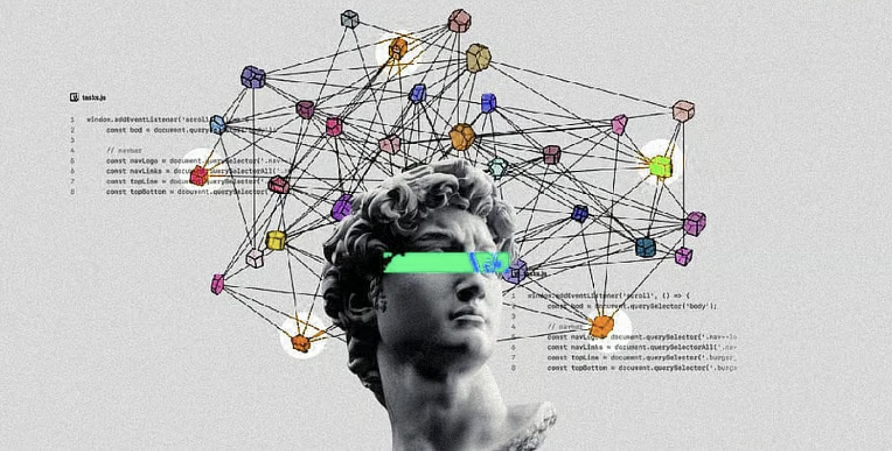

  

# 👋 Hi, I'm Arfat Khan

AI/ML Engineer building production-ready Machine Learning, LLM, and AI systems.

Built and deployed 4 AI products spanning fraud detection, AutoML, resume intelligence, and multi-agent AI systems using Python, FastAPI, LangChain, RAG, and modern AI infrastructure.

## 📈 Highlights

- 284,807+ transactions analyzed in a fraud detection pipeline
- 97% fraud detection accuracy with 89% recall
- 100+ resume and job description evaluations processed
- 4 deployed AI applications
- 4+ specialized AI agents integrated into production workflows
- End-to-end ML pipelines covering training, evaluation, deployment, and inference

📍 Mumbai | 📧 arfathkhan787@gmail.com
---

## 🛠️ Tech Stack

### Languages

🐍 Python | 🗄️ SQL

### Machine Learning

📊 Scikit-Learn | XGBoost | Random Forest | Logistic Regression | Feature Engineering | SMOTE

### Deep Learning

🔥 PyTorch | Neural Networks | CNNs

### LLM & GenAI

🧠 LangChain | RAG | FAISS | ChromaDB | Hugging Face | OpenAI API | Gemini API

### Backend & Tools

⚡ FastAPI | Docker | Git | GitHub | Streamlit | REST APIs | VERCEL | GCP !

---

## 🚀 Featured Projects

### 💳 Fraud Detection System | 97% Accuracy | 89% Recall

Built an end-to-end fraud detection pipeline trained on 284,807 real-world transactions using 31 engineered features. Achieved 97% accuracy and 89% recall on highly imbalanced fraud data through feature engineering, SMOTE, and threshold optimization.

### 🤖 AutoML Studio | 7+ Algorithms | Automated ML Pipeline

Built an end-to-end AutoML platform supporting data preprocessing, feature selection, model training, hyperparameter tuning, and evaluation. Automated 6+ stages of the ML lifecycle, reducing experimentation time from hours to minutes.

### 📄 AI Resume Analyzer | 100+ Resume/JD Evaluations

Built and deployed an LLM-powered application that analyzed 100+ resume-job description pairs, identified skill gaps, scored candidate fit, and generated personalized recommendations in seconds using modern LLM workflows.

### 🧩 HyperMind AI | Multi-Agent Workspace | 4+ AI Agents

Built and deployed a multi-agent AI workspace using FastAPI, React, and Gemini API. Integrated 4 specialized AI agents for coding, research, writing, and learning, enabling complex multi-step workflows through memory, tool calling, and agent orchestration.

---

## 📫 Connect With Me

💼 LinkedIn: https://www.linkedin.com/in/arfat-khan-0211a3265/
📧 Email: [arfathkhan787@gmail.com](mailto:arfathkhan787@gmail.com)

🐙 GitHub: github.com/cypher-aa

---
